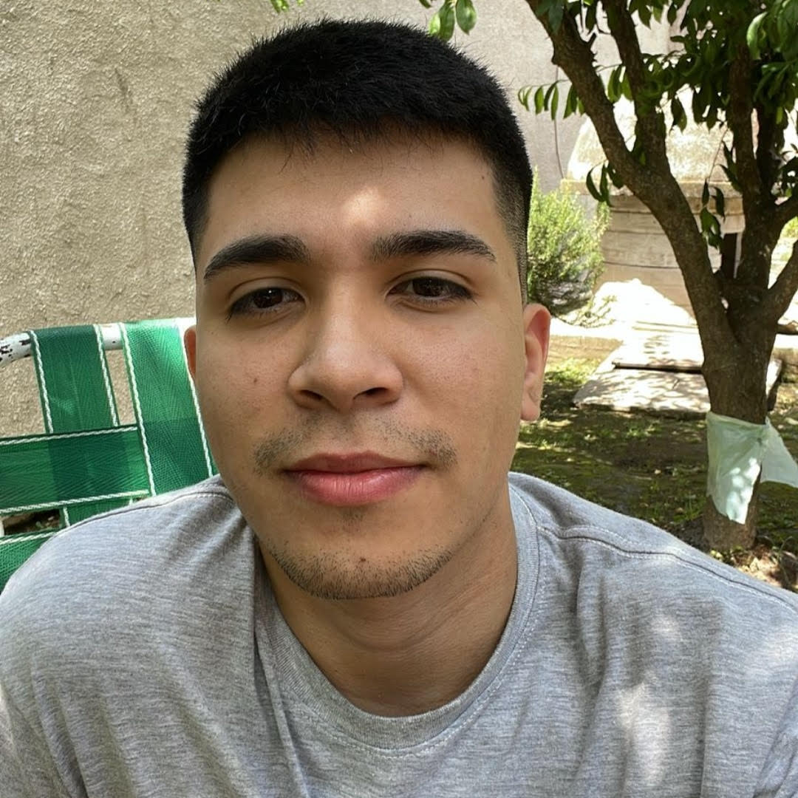

👋 Hi, I’m @christian-ormachea. I am a 23 years old argentinian 🇦🇷 Front-End Developer, currently studying Computer Science on the Universidad Nacional de Quilmes! 
👀 I’m interested JavaScript, React and the Front-End Development in general, I am an enthusiast of the Linux operating system because I have been using it for more than 3 years  
🌱 I’m currently learning React/React Native and strengthening my skills to get a job as a developer/because im an enthusiast too 😁 
💞️ I’m looking to collaborate on various open source projects in the linux community, my dream is to be an active contributor on the open source community
📫 You can contact me via Instagram/LinkedIn or here, in my GitHub! 😀 
